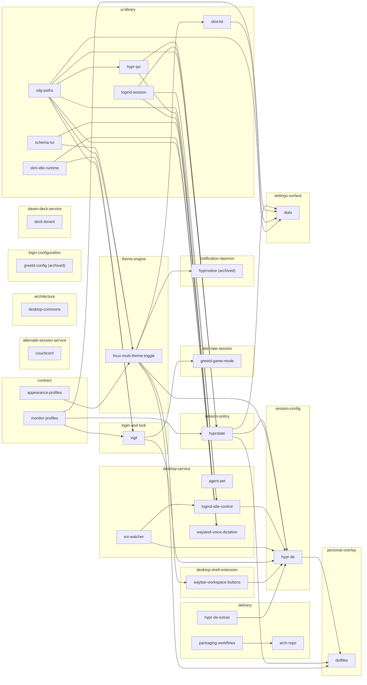

# Ecosystem

> Generated by `scripts/architecture.py`; edit `registry/*.toml`, not this file.

28 registered repositories. Arrows point from a dependency to its consumer.

## Repository registry

| Repository | Role | Lifecycle | Responsibilities |
|---|---|---|---|
| [agent-pet](https://github.com/MasonRhodesDev/agent-pet) | desktop-service | active | agent activity aggregation; Wayland layer-shell mascot; agent activity tray |
| [appearance-profiles](https://github.com/MasonRhodesDev/appearance-profiles) | contract | active | neutral appearance schema; layered appearance resolution |
| [arch-repo](https://github.com/MasonRhodesDev/arch-repo) | delivery | active | pacman repository aggregation; GitHub Pages package publication |
| [couchcord](https://github.com/MasonRhodesDev/couchcord) | alternate-session-service | active | controller-driven Discord voice control; gamescope activity overlay; couch-session diagnostics |
| [deck-tenant](https://github.com/MasonRhodesDev/deck-tenant) | steam-deck-service | active | rootless package tenant; SteamOS package persistence; per-user service wiring |
| [desktop-commons](https://github.com/MasonRhodesDev/desktop-commons) | architecture | active | ecosystem registry; architecture barriers; cross-repository decisions |
| [dials](https://github.com/MasonRhodesDev/dials) | settings-surface | active | desktop settings window; display profile editing; power policy editing; live policy explanation; launching external settings tools from XDG desktop entries |
| [dotfiles](https://github.com/MasonRhodesDev/dotfiles) | personal-overlay | active | machine-specific configuration; personal package selection; chezmoi deployment |
| [greetd-config](https://github.com/MasonRhodesDev/greetd-config) | login-configuration | archived | ReGreet under Hyprland; PAM composition; legacy game-mode configuration |
| [greetd-game-mode](https://github.com/MasonRhodesDev/greetd_game_mode) | alternate-session | active | gamepad-triggered game session; passkey approval gate; greetd dispatch |
| [hypr-de](https://github.com/MasonRhodesDev/hypr-DE) | session-config | active | packaged Hyprland configuration; runtime package set; default configuration |
| [hypr-de-extras](https://github.com/MasonRhodesDev/hypr-de-extras) | delivery | active | COPR hosting for third-party hypr-DE deps that Fedora and other COPRs do not ship; Arch PKGBUILD for overskride |
| [hypr-ipc](https://github.com/MasonRhodesDev/hypr-ipc) | ui-library | active | Hyprland instance discovery; socket2 event listen; hyprctl ok and json |
| [hyprnotice](https://github.com/MasonRhodesDev/hyprnotice) | notification-daemon | archived | notification popups; action-retaining inbox; Hyprland-native notification UI |
| [hyprstate](https://github.com/MasonRhodesDev/hyprstate) | session-policy | active | lid and suspend policy; display profile application; power and GPU policy; session telemetry |
| [linux-multi-theme-toggle](https://github.com/MasonRhodesDev/linux-multi-theme-toggle) | theme-engine | active | Material You palette generation; application theme fan-out; theme configuration |
| [logind-idle-control](https://github.com/MasonRhodesDev/logind-idle-control) | desktop-service | active | per-session idle inhibition; idle-control D-Bus API; idle tray item |
| [logind-session](https://github.com/MasonRhodesDev/logind-session) | ui-library | active | fail-closed logind session resolve; logind inhibitor RAII; login1 Manager and Session proxies |
| [monitor-profiles](https://github.com/MasonRhodesDev/monitor-profiles) | contract | active | neutral monitor topology schema; profile selection; layout resolution |
| [packaging-workflows](https://github.com/MasonRhodesDev/packaging-workflows) | delivery | active | reusable Arch packaging; reusable COPR packaging; GitHub release publication |
| [schema-tui](https://github.com/MasonRhodesDev/schema-tui) | ui-library | active | schema-driven TOML configuration editing |
| [slint-idle-runtime](https://github.com/MasonRhodesDev/slint-idle-runtime) | ui-library | active | event-driven Slint scheduling; coalescing redraw wake; per-output dirty tracking; idle observability |
| [slint-kit](https://github.com/MasonRhodesDev/slint-kit) | ui-library | active | shared Slint controls; design tokens; live LMTT token bridge |
| [sni-watcher](https://github.com/MasonRhodesDev/sni-watcher) | desktop-service | active | persistent StatusNotifier registry; tray survival across bar reloads |
| [vigil](https://github.com/MasonRhodesDev/vigil) | login-and-lock | active | bare-KMS greetd greeter; multi-monitor login layout; ext-session-lock-v1 session lock |
| [waybar-workspace-buttons](https://github.com/MasonRhodesDev/waybar-workspace-buttons) | desktop-shell-extension | active | event-driven workspace buttons; per-workspace scratch zones |
| [wayland-voice-dictation](https://github.com/MasonRhodesDev/wayland-voice-dictation) | desktop-service | active | offline speech recognition; focused-window text injection; dictation HUD and tray |
| [xdg-paths](https://github.com/MasonRhodesDev/xdg-paths) | ui-library | active | fail-closed XDG config paths; fail-closed XDG data paths; fail-closed XDG runtime paths |
