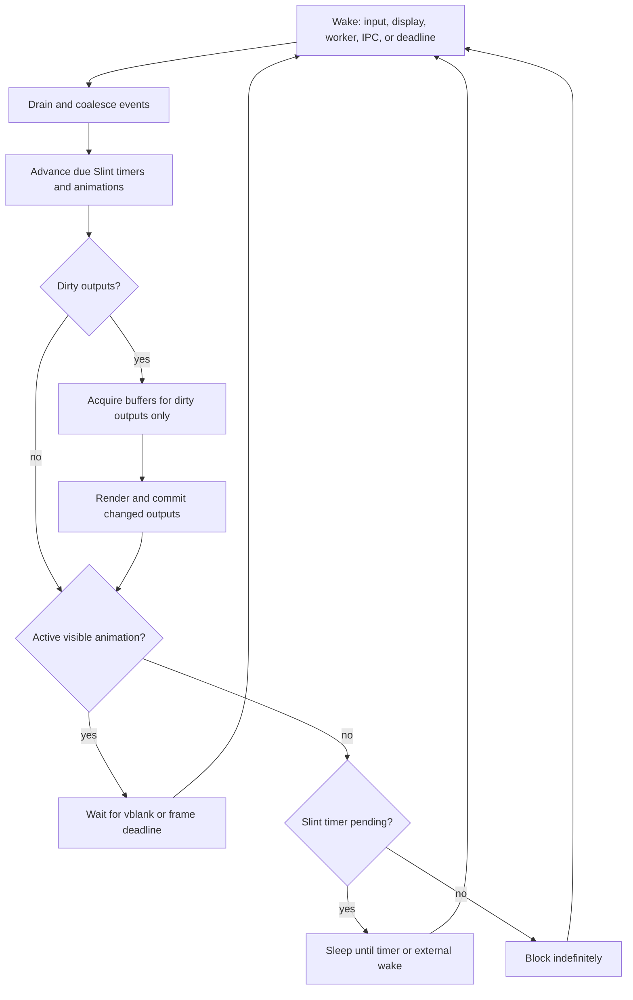
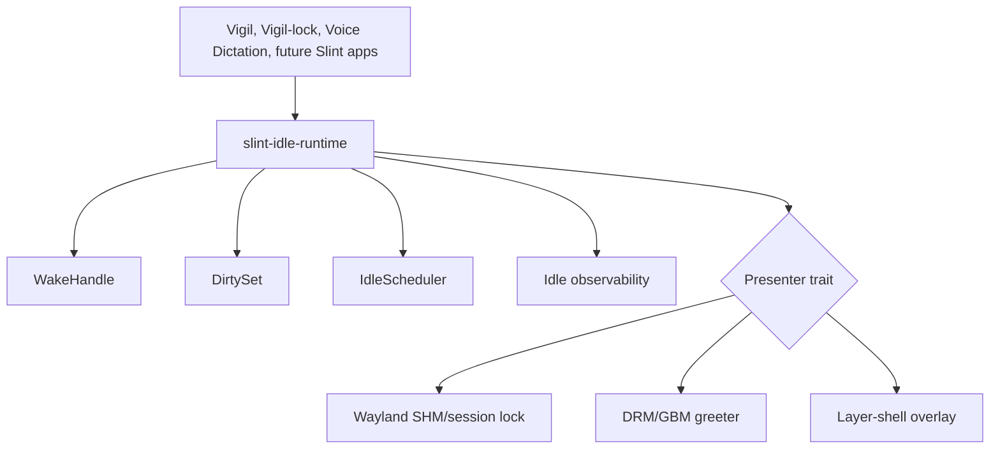

# Slint idle runtime

Status: **implemented as `slint-idle-runtime` 0.1.0** (2026-08-20).

Decision record: [ADR 0002](adr/0002-event-driven-slint-runtime.md).

## Goal

A Slint application with no dirty window, visible animation, or due timer must
perform no periodic work. Its UI thread blocks until an external event or a
real Slint deadline wakes it. Idle cost must not grow with output count.

This applies especially to fullscreen, multi-output, long-lived programs such
as Vigil and Vigil-lock, but the scheduler is also appropriate for persistent
overlays such as Voice Dictation.

## Display states

| State | Surface or plane | CPU rendering | Wake policy |
|---|---|---|---|
| Hidden | Unmapped or absent | None | External events only |
| Static visible | Last committed buffer retained | None | External events or a real timer deadline |
| Animated | Visible surface | Dirty frames only | Vblank or refresh deadline |

A lock screen must submit an initial security buffer. It may then sleep while
the compositor or display controller scans out that unchanged buffer. “Visible”
does not imply “continuously rendering.”

## Scheduler contract

The runtime has only three legal wait decisions:

1. Wait for the next frame when a visible animation is active.
2. Wait until the next Slint timer deadline or an earlier external event.
3. Block indefinitely when neither exists.

On wake:

1. Drain and coalesce input, Wayland/DRM, IPC, worker, and lifecycle events.
2. Call `slint::platform::update_timers_and_animations()`.
3. Determine which outputs are dirty.
4. Acquire buffers, render, and commit **only** those outputs.
5. Query `Window::has_active_animations()` and
   `duration_until_next_timer_update()` to choose the next wait.

`WindowAdapter::request_redraw()` only marks its output dirty and wakes the
loop. It must not query Slint properties, render, or acquire a presentation
buffer.

## Shared crate boundary

The implementation belongs in `desktop-commons` as the Rust crate
`slint-idle-runtime`. It is a platform/runtime adapter, not a `.slint`
language plugin.

The shared crate owns:

- `WakeHandle`: cloneable, thread-safe, and coalescing.
- `DirtySet<OutputId>`: precise per-output presentation intent.
- `IdleScheduler`: chooses frame, timer deadline, or indefinite wait.
- The Slint window-adapter glue that converts redraw requests into dirty+wake.
- Idle counters and assertions: wakes, renders, commits, and buffer acquires.
- A fake-clock test harness for deterministic scheduler tests.

Application-specific crates own:

- Wayland session-lock and SHM presentation.
- DRM/GBM presentation and page-flip handling.
- Layer-shell surface lifecycle.
- Authentication, input routing, and application state.

## Defrost sources

- Keyboard, pointer, or touch input.
- Wayland configure and output lifecycle events.
- DRM hotplug, page-flip completion, VT activation, and resume.
- PAM/authentication results.
- Theme or background asset readiness.
- IPC, configuration, and appearance changes.
- Explicit worker messages.
- Slint timer deadlines and visible active animations.

Multiple wake requests must coalesce before the loop runs.

## Common freeze blockers

- Infinite animations, including animations hidden only by opacity.
- A permanently blinking focused text cursor.
- Repeated Slint timers.
- Setting unchanged properties on a polling cadence.
- Polling files, monitor state, clocks, or worker state.
- Retry loops without bounded backoff.
- Entering a presenter or acquiring a buffer before checking dirtiness.

Cursor flashing should be disabled while dormant. Clocks should use a
one-shot timer for the next displayed boundary (normally the next minute),
not a frame loop or one-second polling process.

## Adoption

The crate and production consumers pin Slint exactly to 1.17.1 so a process
never contains incompatible Slint platform/runtime types.

Adoption order:

1. Align Slint versions.
2. Add the scheduler, wake handle, dirty set, metrics, and fake-clock tests.
3. Adopt in Vigil-lock and validate the session-lock path on metal.
4. Adopt in Vigil and validate direct DRM/GBM scanout on metal.
5. Adopt in Voice Dictation and remove its hidden-state 16 ms timer.
6. Tag, package, install released artifacts, and repeat metal soak tests.

## Verification gates

- Hidden idle: zero renders and zero commits.
- Static visible idle: zero renders after the initial committed frame.
- Multi-output idle: zero work independent of output count.
- Defrost: first new frame within one refresh interval.
- Ten-minute idle: effectively zero UI-thread CPU.
- No Slint deadline: event loop demonstrably blocks indefinitely.
- Minute clock: exactly one wake and affected-output commit per minute.
- Stuck application state cannot create an unbounded animation or retry loop.

These gates must be exercised with fake-clock unit tests, presenter test
doubles, and metal measurements of wakeups, renders, commits, buffer
acquisitions, CPU time, and compositor load.
